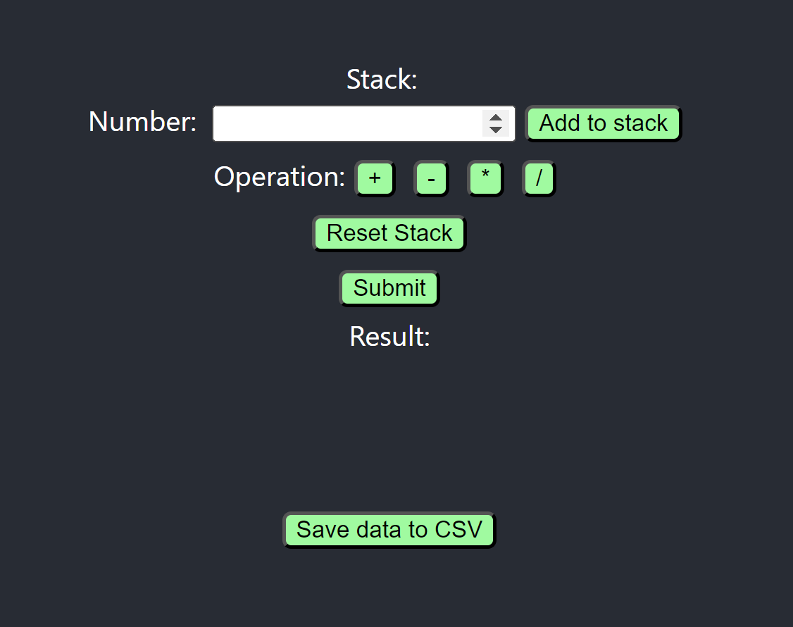
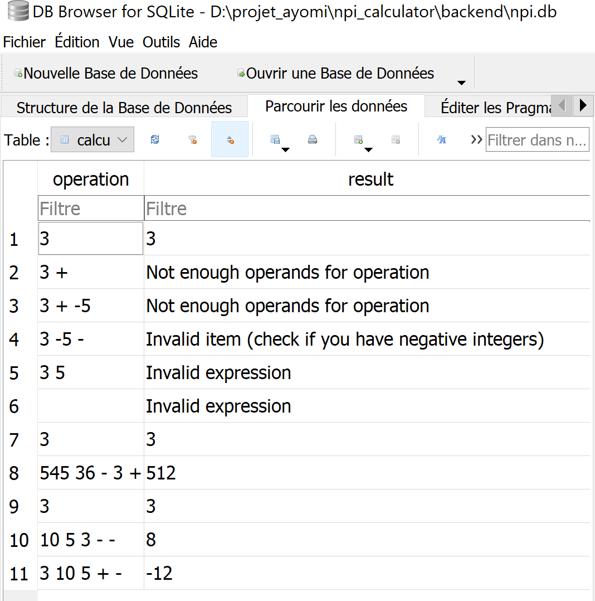
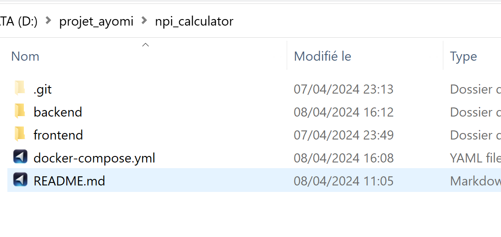
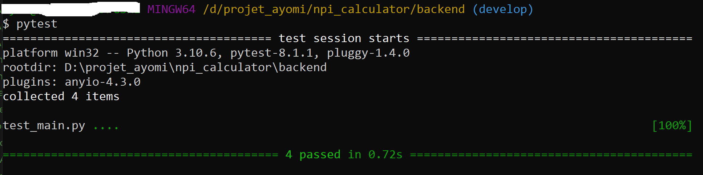

# Description

## Project goals

The goal of the project is to implement the Reverse Polish Notation (RPN). 
It is a mathematical notation in which every operator follows all of its operands. In other words, the operator is placed after the operands.

In RPN, operators come after the operands they operate on. For example, instead of writing `2 + 3`, you would write `2 3 +`.

RPN eliminates the need for parentheses to specify the order of operations. For example, instead of writing `(2 + 3) * 4`, you would write `2 3 + 4 *`.

To evaluate an expression in RPN, you start from the left and scan the expression one token (operand or operator) at a time.

## How it works ?

The frontend displays an interface with :
- the result stack shown at the top
- a number input field to enter the numbers (operands)
- button to be clicked to add operators 

[](frontend_calc.png)

The reset button under the Operators is used to reset the stack. 
After having filled the stack, you can click on the submit button to launch the calculation. 
This will also save the result in a SQLite database `npi.db` inside the backend folder (in a table called calculations with 2 fields: `operation` and `result`) as displayed in the image below.

[](db.png)

You can clik on the "Save data to CSV" button to save the previous results stored in the database as a csv file ("*data.csv*") inside the project backend folder.

# Launch the project

## With docker compose

The below image shows a *docker-compose.yml* file containing the services used to launch the project. We just need a python fastapi server (here is *uvicorn*) and a reactjs starter (here launched with *react-scripts* via *yarn* commands). We decided to use a SQLite database to facilitate the handling of data without needing a powerful server. 
The backend and frontend folders contains the Dockerfile for each of those services.

[](project_folder.png)

To launch the project using `docker compose` command, you first need to have docker (or docker desktop for windows) installed in your computer. Then, open a terminal and move to the project folder (''*npi_calculator*''). After that, just enter the following command:
```
docker compose up
```

## As seperate services

Apart from the previous method, you could also open two distinct terminals (one for each service).
Then, move to the project backend folder (''*npi_calculator/backend*'') to launch the backend server, by typing the following command.
```    
uvicorn main:app --reload
```
For the frontend one, move to the project frontend folder (''*npi_calculator/frontend*'') to launch the frontend server, by typing the following command.
```
yarn start
```

# Tests

For the moment, we just implement some backend python tests. We use `pytest` library for testing. Just type the following command on a terminal (inside the backend folder):
```
pytest
```
Here is an image showing our current results.

[](python_tests.png)

# TODO (Next steps)

There is still some work to do. The next steps we have identified are:

- Http response handling (error codes, etc.)
- Comment code 
- Move params like host, port to config files or env vars
- Javascript tests and complete python tests (db, save csv file...)