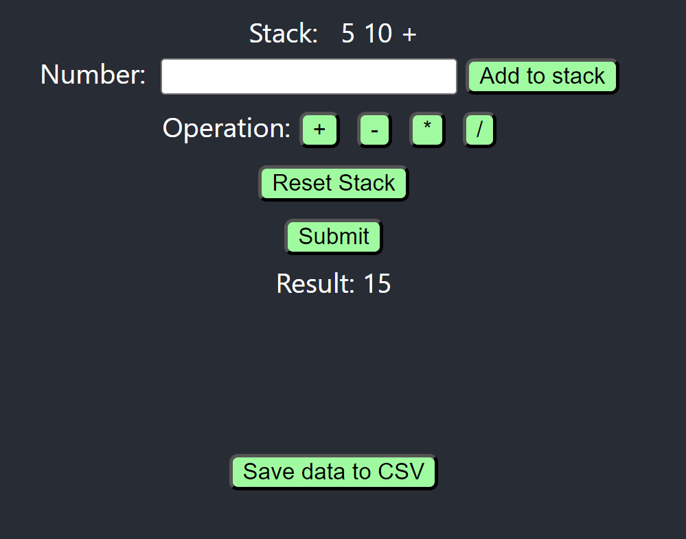

# Description

## Project goals

    The goal of the project is to implement the Reverse Polish Notation (RPN). 
    It is a mathematical notation in which every operator follows all of its operands. In other words, the operator is placed after the operands.

    In RPN, operators come after the operands they operate on. For example, instead of writing `2 + 3`, you would write `2 3 +`.

    RPN eliminates the need for parentheses to specify the order of operations. For example, instead of writing `(2 + 3) * 4`, you would write `2 3 + 4 *`.

    To evaluate an expression in RPN, you start from the left and scan the expression one token (operand or operator) at a time.

## How it works ?

    The frontend displays an interface with :
    - the result stack shown at the top
    - a number input field to enter the numbers (operands)
    - button to be clicked to add operators 

    The reset button under the Operators is used to reset the stack.
    After having filled the stack, you can click on the submit button to launch the calculation.
    This will also save the result in a SQLite database `npi.db` inside the backend folder. 

# Launch the project

    ## With docker compose

    ## As seperate services

    uvicorn main:app --reload
    yarn start

# Tests

# TODO (Next steps)

TODO
    - http response handling (error codes, etc.)
    - code comments 
    - move params like host, port to config files or env vars
    - javascript tests and complete python tests (db, save csv file...)